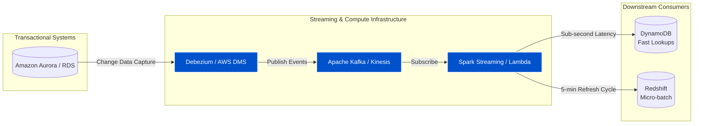
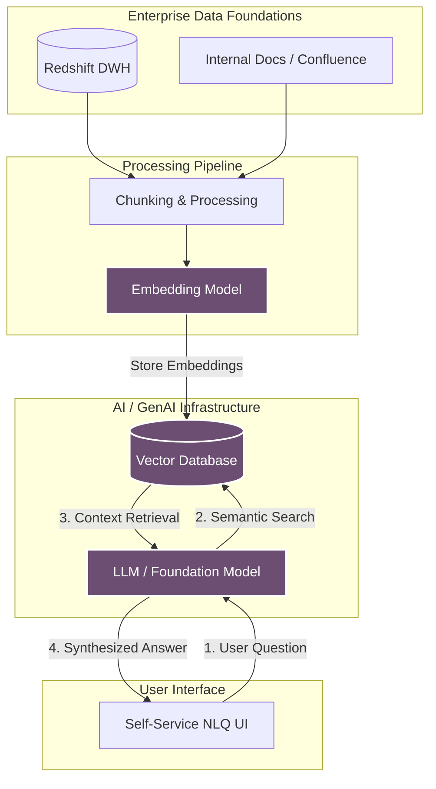

# Krishnanand Anil — Senior Data Engineer / Data Architect

**Data Platform Architect | Cloud Data Specialist (AWS) | Builder of Reliable Systems**

I design and build modern **data warehouses**, **lakehouse platforms**, and **real-time event streaming systems** that analysts trust and engineers enjoy maintaining. While my core expertise is in AWS data architecture, ETL/ELT automation, and performance tuning, I also build full-stack AI applications and modern web platforms. 

**Connect:**
- 🌐 **Portfolio:** [krishnanandanil.com](https://www.krishnanandanil.com)
- 💼 **LinkedIn:** [linkedin.com/in/krishnanand-anil](https://linkedin.com/in/krishnanand-anil)
- 📧 **Email:** krishnanandpanil@gmail.com

---

## 🏗️ Architecture Patterns I Build

*GitHub natively renders these diagrams. If you are viewing the raw file, switch to preview mode.*

### 1. Modern Enterprise Lakehouse & Data Warehouse (AWS)
*Medallion architecture utilizing Apache Iceberg on S3, orchestrated via Airflow and dbt.*

graph TD
    subgraph "Data Sources"
        A[PostgreSQL / MySQL]
        B[SaaS / REST APIs]
        C[Flat Files / Logs]
    end
    
    subgraph "Data Lakehouse (AWS S3 + Apache Iceberg)"
        D[(Bronze Layer Raw Data)]
        E[(Silver Layer Cleaned & Filtered)]
        F[(Gold Layer Business Aggregates)]
    end
    
    subgraph "Processing & Orchestration"
        G[Apache Airflow]
        H[AWS Glue / PySpark]
        I[dbt]
    end
    
    subgraph "Serving & Analytics"
        J[Amazon Athena]
        K[(Amazon Redshift Enterprise DWH)]
        L[BI Dashboards]
    end
    
    A & B & C -->|Ingestion| D
    G -.->|Orchestrates| H
    G -.->|Orchestrates| I
    
    D -->|AWS Glue / Spark| E
    E -->|dbt Transformations| F
    
    F -->|Serverless Query| J
    F -->|COPY / External Schema| K
    
    J --> L
    K --> L

    classDef aws fill:#FF9900,stroke:#232F3E,stroke-width:2px,color:black;
    classDef storage fill:#3F8624,stroke:#232F3E,stroke-width:2px,color:white;
    class D,E,F storage;
    class H,J,K aws;

### 2. Real-Time CDC & Event Streaming (50M+ Events/Day)
*Event-driven architecture decoupling source databases from downstream analytics with sub-second latency.*

### 3. AI-Ready Analytics & RAG Platform
*Bridging enterprise data with Large Language Models for Natural Language Querying (NLQ).*

---

## 📂 Featured Repositories & Projects

### 🧠 AI & LLM Engineering
* **[ResumeForge-AI](https://github.com/sudo-krish/ResumeForge-AI)**  
  An AI-powered resume generation tool that turns standard bullet points into FAANG-worthy achievements. Demonstrates practical integration of Generative AI, LLMs, and prompt engineering in a functional application.

### ⚡ Full-Stack & Platform Development
* **[portfolio_sveltekit](https://github.com/sudo-krish/portfolio_sveltekit)**  
  My personal portfolio and blog architecture. A modern, highly performant web application built with **SvelteKit** and deployed on Cloudflare Pages utilizing Server-Side Rendering (SSR). 
* **[portfolio-angular](https://github.com/sudo-krish/portfolio-angular)**  
  An alternative frontend architecture implementation utilizing Angular, demonstrating component-based UI design.

### 📊 Machine Learning & Data Science
* **[Abalone_classification_regression](https://github.com/sudo-krish/Abalone_classification_regression)**  
  End-to-end Exploratory Data Analysis (EDA), regression, and classification models applied to the Abalone dataset using Python.
* **[Flower-recognition-Keras_sequential](https://github.com/sudo-krish/Flower-recognition-Keras_sequential)**  
  A deep learning computer vision model built using Keras Sequential API to accurately classify flower species.

*(Note: My large-scale enterprise data engineering architectures are proprietary and closed-source, but you can read detailed architectural breakdowns on my [Portfolio](https://www.krishnanandanil.com).)*

---

## 🛠️ Tech Stack

**Cloud & Infrastructure (AWS):** S3, Athena, Glue, EMR, Lambda, Kinesis, Redshift, Aurora PostgreSQL, DynamoDB, IAM, Terraform, Docker, Kubernetes (K8s)  
**Data Engineering:** Apache Kafka, Debezium (CDC), Apache Airflow, dbt, Spark/PySpark, Hadoop, ETL/ELT  
**Architecture Patterns:** Event-Driven Architecture, Microservices, Medallion Data Lakes, Dimensional Modeling, Reference Architectures  
**App & Web Dev:** Python, SQL, TypeScript, SvelteKit, Angular, Flutter, REST/GraphQL APIs  
**AI/ML:** RAG, Vector Databases, Keras, Pandas, Scikit-learn  

---

## 🔭 What I’m Exploring Now

- **Metadata-driven warehouse automation:** Treating data ownership, tests, and lineage as code.
- **Agentic AI Architecture:** Using specialized LLM agents for data quality anomaly detection and automated documentation.
- **Advanced Lakehouse Patterns:** Schema evolution and time travel with Apache Iceberg on S3.

---

## 💡 A Few Opinions on Data

- “SELECT *” is fine—as long as you know **why** you’re doing it.
- A well-modeled schema will always beat a fancy dashboard.
- The best data pipelines are the ones you forget exist because they never break.

> *"Good data models are like good jokes — if you have to explain them, they’re not working."*

If you see something interesting in my repos, clone it, break it, and make it better.
